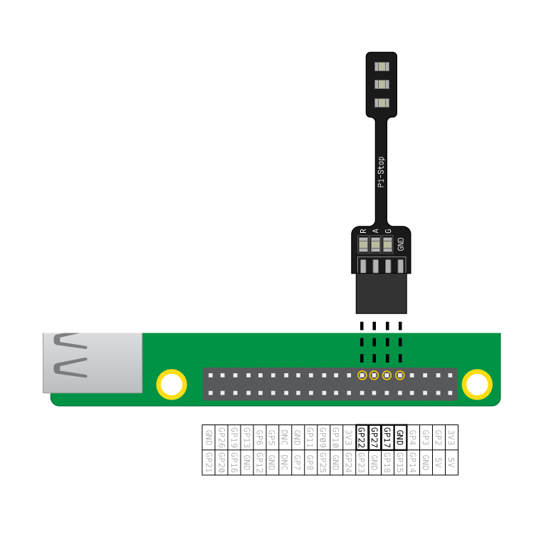

## Свържете светодиодите

\--- task \---

Свържете светодиодите към следващите пинове:

| Светодиод  | GPIO пин |
| ---------- |:--------:|
| Червен     |    22    |
| Кехлибарен |    27    |
| Зелен      |    17    |

\--- /task \---